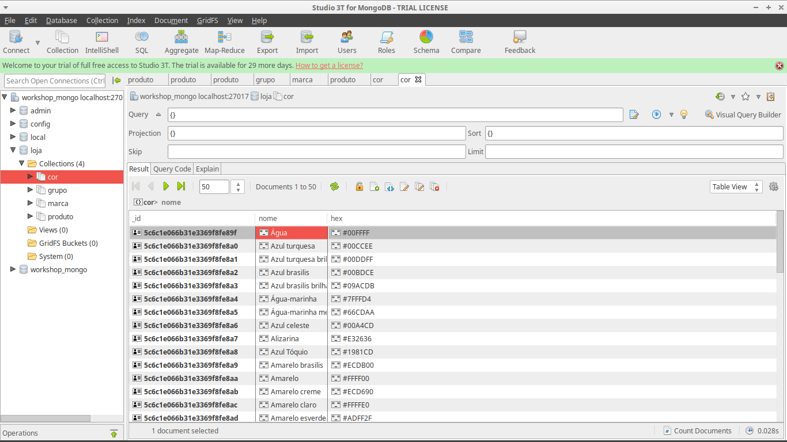
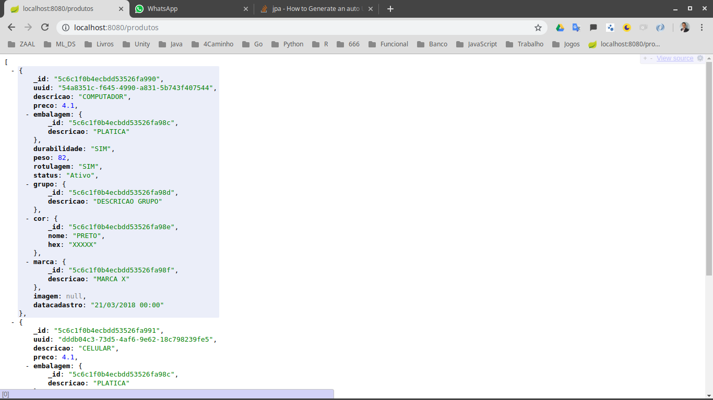

# :: Spring Boot ::  (v2.2.0.BUILD-SNAPSHOT)
#RESPOSTAS DO SISTEMA
Sistema de Classificação Aspinwall. Ele classifica e atribui nota ao produtos baseado em cinco variáveis:

1) taxa de reposição - qual a frequência com que o produto é recomprado.
2) margem bruta - quanto lucro é obtido de cada produto (preço médio de venda menos custo unitário médio).
3) ajuste de objetivo do comprador - qual a flexibilidade dos hábitos de consumo dos compradores em relação a esse produto.
4) duração da satisfação do produto - por quanto tempo o produto irá produzir benefícios ao usuário.
5) duração do comportamento de busca do comprador - quanto tempo eles demorarão para comprar o produto.

# LOJA
# Loja-MongoDB # Importar csv
 mongoimport -d loja -c cor --type csv --headerline --file dir/cor.csv

# Baixando o MongoDB e PostgreSQL e Redis
docker pull mongo:"4.0.4"
# Rodando no Docker o mongo
docker run --name mongo-springboot -p 27017:27017 -d mongo
#Verificando
docker ps -a
#Executando o Docker
docker exec -it mongo-springboot mongo admin
#Parando
docker stop mongo-springboot

# Criando
docker run --name zaaldb -e POSTGRES_PASSWORD=debian23 -d postgres

# Executando
docker exec -it zaaldb psql -U postgres

# Executando
docker run --name zaaldb -v "$PWD"/:/opt/zaaldb/ -e POSTGRES_PASSWORD=debian23
-d postgres

