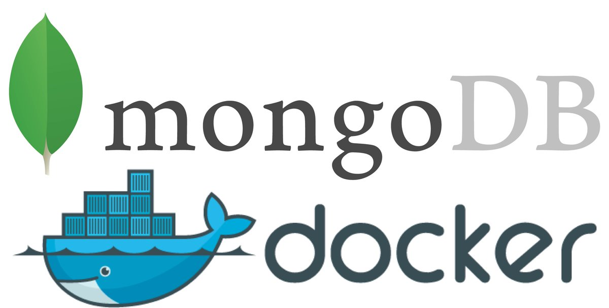

# :: Spring Boot ::  (v2.2.0.BUILD-SNAPSHOT)
#RESPOSTAS DO SISTEMA
Sistema de Classificação Aspinwall. Ele classifica e atribui nota ao produtos baseado em cinco variáveis:

1) taxa de reposição - qual a frequência com que o produto é recomprado.
2) margem bruta - quanto lucro é obtido de cada produto (preço médio de venda menos custo unitário médio).
3) ajuste de objetivo do comprador - qual a flexibilidade dos hábitos de consumo dos compradores em relação a esse produto.
4) duração da satisfação do produto - por quanto tempo o produto irá produzir benefícios ao usuário.
5) duração do comportamento de busca do comprador - quanto tempo eles demorarão para comprar o produto.

# LOJA

# Loja-MongoDB # Importar csv
 mongoimport -d loja -c cor --type csv --headerline --file dir/cor.csv

# Baixando o MongoDB e PostgreSQL e Redis
docker pull mongo:"4.0.4"

# Verifica as imagens baixadas
docker images

# Rodando no Docker o MongoDB
docker run -it --name mongo-springboot -p 27017:27017 -d mongo

# Verificando os Contêineres 
docker ps -a
docker stats

# Executando MongoDB
docker exec -it mongo-springboot mongo admin

# Parando, Restartando, Apagando MongoDB
docker stop mongo
docker restart mongo
docker rm mongo

# Parando MongoDB
docker stop mongo-springboot

# Criando PostgreSQL
docker run --name zaaldb -e POSTGRES_PASSWORD=debian23 -d postgres

# Executando PostgreSQL
docker exec -it zaaldb psql -U postgres

# Executando PostgreSQL com senha
docker run --name erpBD -v "$PWD"/:/opt/erpBD/ -e POSTGRES_PASSWORD=debian23
-d postgres

